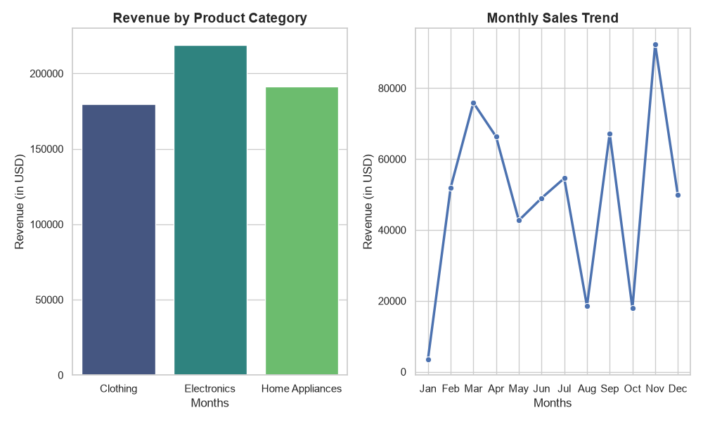
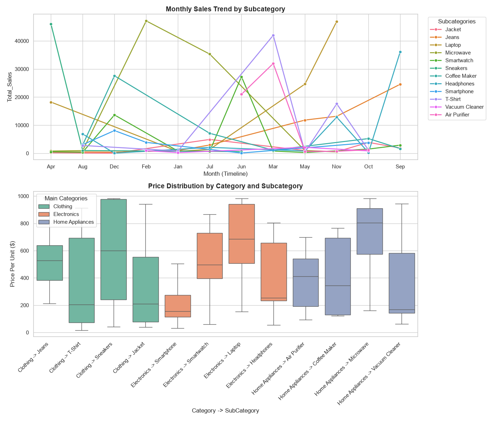
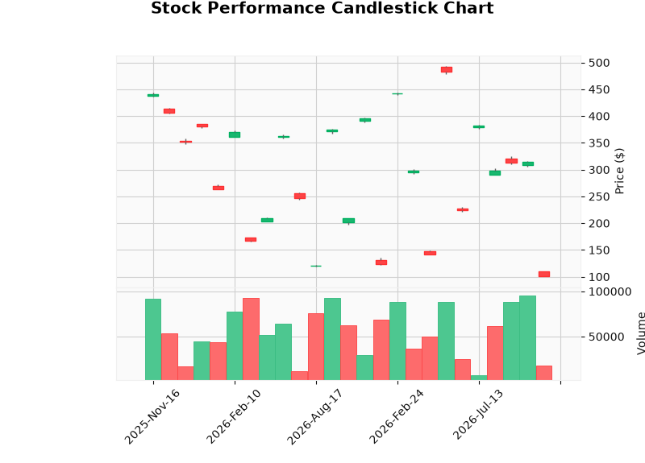
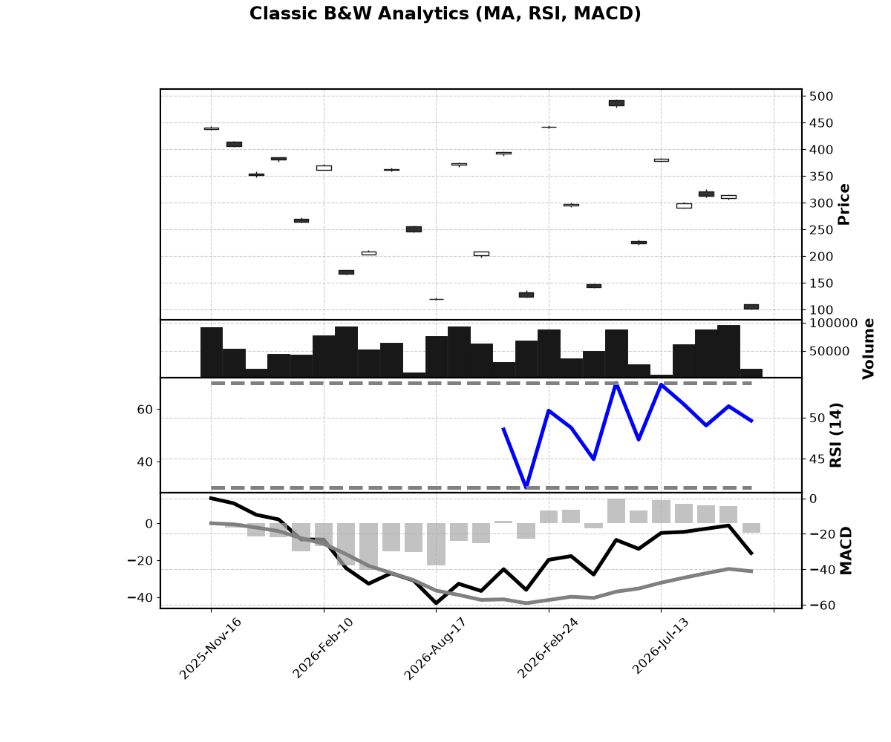

# Sample Data Engineering

* **Create and activate virtual environment:**
  ```bash
  python -m venv .deenv
  .deenv\bin\activate.ps1  # Windows PowerShell
  source .deenv/bin/activate #MAC OS
  pip install dotenv pandas matplotlib seaborn mplfinance
  pip install -e .
  pip freeze > requirements.txt
  #deactivate environment if required
  deactivate
  ```
* **Install dependencies:**
  ```bash
  pip install dotenv pandas matplotlib seaborn
  ```
* Freeze Requirement
  ```bash
  pip freeze > requirements.txt
  ```
* Install  Requirement
  ```bash
  pip install -r requirements.txt
  ```
* Execute
  ```bash
  <Project Root>/python src/sample_de/dodo.py
  ```
* Example
  - <p align="center">
    

  </p>
  - <p align="center">
    
  </p>
  - <p align="center">
    
  </p>
  - <p align="center">
    
  </p>
